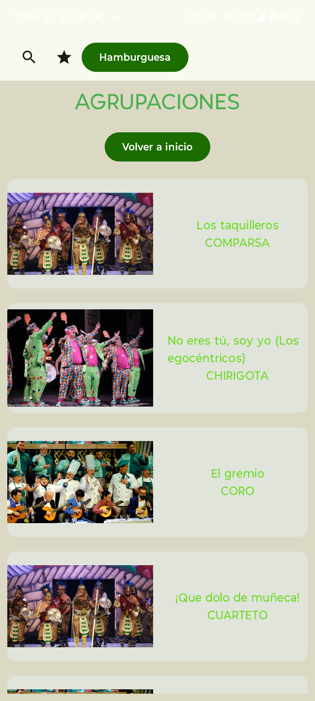
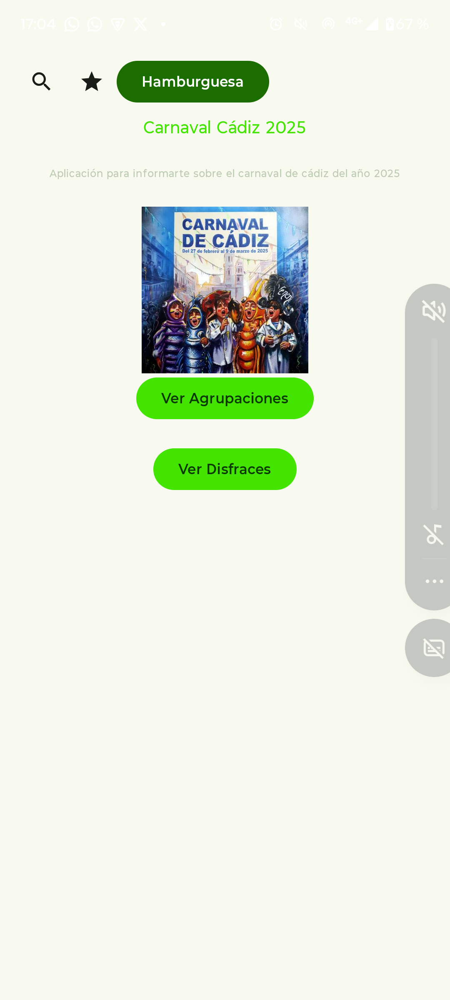
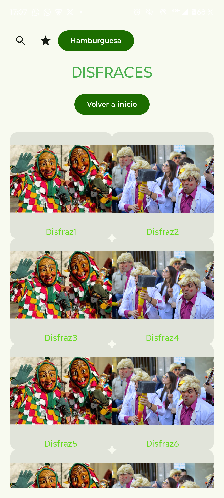

# Examen DESARROLLO DE INTERFACES
## Gonzalo Romero Bernal 2DAM
# PARTE 7

## 1. Pruebas funcionales
He realizado distintas pruebas para poder comprobar como ha ido el proyecto a lo largo del proyecto en distintas zonas.
1. Se ha comprobado los distintos cambios de colores según el modo de visualización en distintos tipos gracias al @Preview
2. Se ha comprobado que al abrir la pestaña correspondiente de Agrupaciones se ha mostrado el contenido esperado, que eran las distintas agrupaciones especificadas en la lista previamente.
3. Se ha comprobado que los botones realizan correctamente sus funciones ya que se permite al usuario que pueda navegar libremente por la aplicación.

## 2. Integración lista + dialog
A la hora de realizar la lista de las distintas agrupaciones, se ha realizado un item reutilizable para cada elemento que permite que cada componente se pueda visualizar de la misma manera. Dentro de este item, se ha implementado una variable que se guarda aun cuando se recompone la vista, de tipo `Boolean` para que, cuando esta se establezca `true`, se muestre un dialogo.

https://github.com/gromber05/examenDin/blob/8f4226a93c1e20573b61e8f7f2983cf16dbd37fd/app/src/main/java/com/gromber05/examendin/AgrupacionesScreen.kt#L84-L164

## 3. Regresión
He realizado distintos cambios cuando he terminado, ya que los colores que poseía la aplicación no concordaban, o se hacía bastante malo para la vista, lo que lo convertía en una aplicación con poca accesibilidad.

# PARTE 8
## 1. Diseño

Se ha escogido este diseño ya que recuerda bastante a lo que es el carnaval, se recogen los colores bastante típicos
de este que es son el verde y el amarillo. 

Se han usado distintas tonalidades de colores para facilitar la accesibilidad de la aplicaión aplicando diversas prácticas como el buen contraste entre elementos que posee funcionalidades y los que no.

## 2. Capturas

## 3. Accesibilidad (También parte 6)

Se han realizado distintas prácticas para poder facilitar la accesibilidad de nuestra aplicación, como la implementación de contentDescription en imágenes, botones e iconos para facilitarles la tarea a aquellos con dificultades.

Se ha elegido un contraste acorde a los colores escogidos para el proyecto, ya que deja leer perfectamente los textos y no oculta ningún elemento.

Las distintas tipografías y colores escogidos han sido acorde al tema de la aplicación, en este caso, el carnaval de Cádiz 2025.

Se han implementado botones para que el usuario pueda navegar dentro de la aplicación a las diferentes vistas que contiene.

Se han detectado bastantes problemas con la aplicación a la hora de colocar los colores dentro de esta, ya que durante las pruebas de preview, se han podido observar alguna falla con el IDE.

## 4. Usabilidad

Posee una navegación muy simple con dos botones en la pantalla principal para dirigirnos a las otras dos pantallas: Agrupaciones y Disfraces.

Cada elemento de la lista de agrupaciones es funcional, y al presionar sobre uno de ellos se abre un dialogo que muestra en profundidad las características de cada uno.

## 5. Decisión de componentes

He usado Scaffold y TopAppBar para establecer una buena estrctura dentro de mi aplicación. También, he hecho uso de LazyColumn para mostrar la lista de las agrupaciones de una manera más eficiente y que usa menos recursos.
He hecho uso también de Card para los items reutilizables y les he incorporado Row y Column para poder establecer los elementos de la lista(imágenes y texto).
Para el dialogo, se ha implementado AlertBasicDialog para mostrar la información detallada de cada elemento que posee la lista de agrupaciones.

## 6. Pruebas

Se han realizado pruebas sobre los distintos componentes que posee la aplicación:
- Se ha comprobado que realmente funcionan los distintos botones que permiten la navegación.
- Se ha comprobado que se muestran ambas listas en sus respectivas vistas.
- Se ha comprobado que se puede visualizar cada elemento de la lista en profundidad gracias a la funcionalidad integrada.

## 7. Conclusiones

Esta aplicación llega al objetivo de ofrecer una vista del Carnaval de Cadiz 2025 que permite al usuario consultar distintas agrupaciones y poder visualizar sus detalles de una forma rápida y sencilla.
He aplicado dentro de este proyecto conceptos clave de Jetpack Compose como lo son los estados que se mantienen aunque se recomponga la vista, la lazyColumn y el lazyVerticalGrid que permite que la lista cargue solo los objetos que se pueden visualizar.
Como resultado hemos obtenido una app pequeña, pero con una buena estructura y que puede ser ampliable